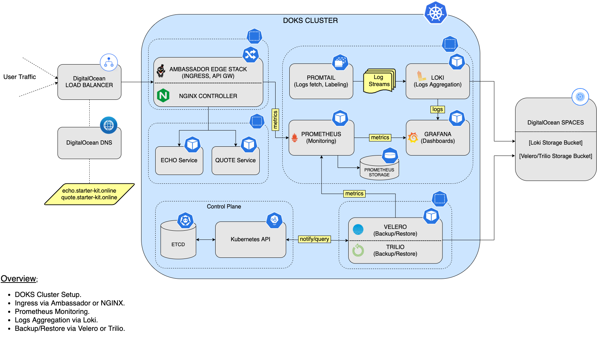
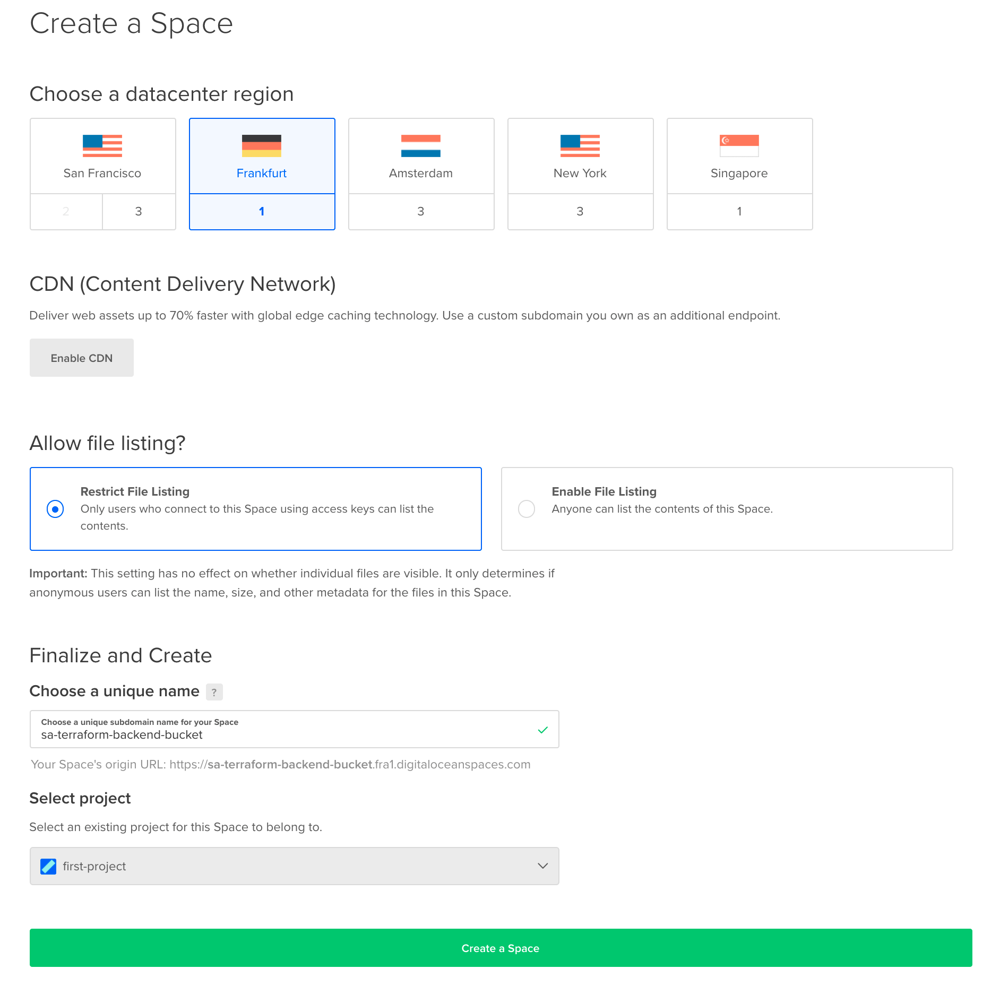

# Infrastructure configurations at Digital Ocean with Terraform

## Introduction

[Terraform](https://www.terraform.io) helps you create and automate the running infrastructure, like your `Kubernetes` cluster. 
Then, [Flux CD](https://fluxcd.io) helps you `synchronize` the `state` of your infrastructure using `Git` as the source of truth, and follow `GitOps` principles.

To handle cluster reconciliation, via the [Source Controller](https://fluxcd.io/docs/components/source/), 
and handle `Helm` releases, via the [Helm Controller](https://fluxcd.io/docs/components/helm).

## Operations-ready Setup Overview

Below is a diagram that gives a high-level overview stack setup, as well as the main steps:



## Software you need to install on your machine

- HashiCorp [Terraform](https://learn.hashicorp.com/tutorials/terraform/install-cli) CLI, for provisioning the infrastructure.
- [Kubectl](https://kubernetes.io/docs/tasks/tools/)  CLI, for `Kubernetes` interaction.
- [Doctl](https://docs.digitalocean.com/reference/doctl/how-to/install/) CLI, for `DigitalOcean` API interaction.
- [Flux](https://fluxcd.io/docs/installation/) CLI, for `Flux CD` interaction.
- [Kubeseal](https://github.com/bitnami-labs/sealed-secrets#installation), for encrypting secrets and `Sealed Secrets Controller` interaction.

## Configure access keys 

### on DigitalOcean

- Create a Token/keys (`API > Token > Personal access tokens`)
  - Please follow the official `DigitalOcean` tutorial on how to [create a personal access token](https://docs.digitalocean.com/reference/api/create-personal-access-token). Copy the key and secret value, and save each in a local environment variable for later use (make sure to replace the <> placeholders accordingly):

```shell
export TF_VAR_do_api_token="<YOUR_API_KEY>"
```

- Create a Spaces access keys for DigitalOcean Spaces (`API > Token > Spaces access keys`) (S3-compatible object storage) 
  - Please follow the official `DigitalOcean` tutorial on how to [create a personal access token](https://docs.digitalocean.com/reference/api/create-personal-access-token). Copy the key and secret value, and save each in a local environment variable for later use (make sure to replace the <> placeholders accordingly):
  
```shell
export DO_SPACES_ACCESS_KEY="<YOUR_DO_SPACES_ACCESS_KEY>" &&
export DO_SPACES_SECRET_KEY="<YOUR_DO_SPACES_SECRET_KEY>" &&
export TF_VAR_spaces_access_id=$DO_SPACES_ACCESS_KEY &&
export TF_VAR_spaces_secret_key=$DO_SPACES_SECRET_KEY
```
Helper: [Terraform Complex-Typed Values](https://www.terraform.io/docs/language/values/variables.html#complex-typed-values)

### On GitHub

- Create a Personal access tokens (`Settins > Developer settins > Personal access tokens`)
  - Add the following permissions:
    - repo
    - admin:public_key
    - admin:repo_hook
    - notifications
    - admin:gpg_key

```shell
export TF_VAR_github_user="<YOUR_USER_GIT>" &&
export TF_VAR_github_token="<YOUR_API_KEY>"
```

## Git repositories for settings

- Flux repo:
  - There must be a repository configured in the environment variables. File: `env-<env-name>.tfvars`. Review the following variables:
    - `var.git_repository_name`
    - `var.git_repository_branch`
    - `var.git_repository_sync_path`

## Terraform Tips

- [Understanding terraform count, for_each and for loop](https://jhooq.com/terraform-for-and-for-each-loop/)

## Init Terraform

- First make sure the `sa-terraform-backend-bucket` bucket was created in `DO Spaces`.
  - Please follow the official `DigitalOcean` tutorial on how to [create](https://docs.digitalocean.com/products/spaces/how-to/create). Make sure that it is set to `restrict file listing` for security reasons.
  
  

- Initialize the `Terraform` backend. You're going to use the `DO Spaces` access and secret key:

```shell
terraform init  \
    --backend-config="key=$DO_SPACES_ACCESS_KEY" \
    --backend-config="access_key=$DO_SPACES_ACCESS_KEY" \
    --backend-config="secret_key=$DO_SPACES_SECRET_KEY"
```

- The output looks similar to (check for the `Successfully configured the backend "s3"!` message):

```text
Initializing the backend...

Successfully configured the backend "s3"! Terraform will automatically
use this backend unless the backend configuration changes.

Initializing provider plugins...
- Finding fluxcd/flux versions matching "~> 0.8.0"...
- Finding hashicorp/tls versions matching "~> 3.1.0"...
...
```

Next, run [Terraform plan](https://www.terraform.io/docs/cli/commands/plan.html) and inspect infrastructure changes: 

```shell
terraform plan \
  -out plan.out \
  -var-file env-dev.tfvars 
```
**Importantly, select the correct variable file for the environment.**


Finally, if everything looks good, apply changes using `Terraform`:

```shell
terraform apply "plan.out"
```

### Terraform Destroy

```shell
terraform plan \
  -destroy \
  -out plan.out \
  -var-file env-staging.tfvars 
```

```shell
terraform apply "plan.out"
```

### DOKS Cluster

First, you have to set the `kubectl` context to point to your `DOKS` cluster. List the available `Kubernetes` clusters first:

```shell
doctl auth init -t $TF_VAR_do_api_token
doctl k8s cluster list
```
```shell
ID                                      Name                  Region    Version        Auto Upgrade    Status     Node Pools
86fb55c0-0177-4f43-a77a-be2d2a5ffd50    sa-cluster-dev    fra1      1.21.5-do.0    false           running    levis-cluster-test-pool
```

Point `kubectl` to your cluster (make sure to replace the `<>` placeholders accordingly):

```shell
doctl k8s cluster kubeconfig save <your_doks_cluster_name>
```
```shell
Notice: Adding cluster credentials to kubeconfig file found in "/Users/<your_user>/.kube/config"
Notice: Setting current-context to <your_doks_cluster_name>
```


Please check that the context was set, and that it's pointing to your `Kubernetes` cluster:

```shell
kubectl config get-contexts
```

List cluster nodes, and make sure that they're in a healthy state (`STATUS` column says `Ready`):

```shell
kubectl get nodes
```

```shell
NAME                            STATUS   ROLES    AGE   VERSION
levis-cluster-test-pool-ub1f5   Ready    <none>   26m   v1.21.5
levis-cluster-test-pool-ub1fp   Ready    <none>   26m   v1.21.5
levis-cluster-test-pool-ub1fs   Ready    <none>   26m   v1.21.5
```


### Flux CD

`Flux` provides a `CLI` binary, which you can use for provisioning `Flux CD` itself, as well as for main system interaction. You can also use it to export `manifests` and create Flux CD `resources` for your `DOKS` cluster.

First, you can perform some `sanity checks` via:

```shell
flux check
```
```shell
► checking prerequisites
✔ Kubernetes 1.21.5 >=1.19.0-0
► checking controllers
✔ helm-controller: deployment ready
► ghcr.io/fluxcd/helm-controller:v0.14.0
✔ kustomize-controller: deployment ready
► ghcr.io/fluxcd/kustomize-controller:v0.18.1
✔ notification-controller: deployment ready
► ghcr.io/fluxcd/notification-controller:v0.19.0
✔ source-controller: deployment ready
► ghcr.io/fluxcd/source-controller:v0.19.0
✔ all checks passed
```


Then, inspect all `Flux CD` resources via:

```shell
flux get all
```

n case you need to perform some troubleshooting, and see what `Flux CD` is doing, you can access the logs via:

```shell
flux logs
kubectl -n flux-system get kustomization flux-system -oyaml
kubectl -n flux-system get gitrepository flux-system -oyaml
```

Finally, check that `Flux CD` points to your `Git` repository:

```shell
kubectl get gitrepositories.source.toolkit.fluxcd.io -n flux-system
```

The output looks similar to (notice the `URL` column value - should point to your `Git` repository, and the `READY` state set to `True`):

```text
NAME          URL                                                       READY   STATUS                                                            AGE
flux-system   ssh://git@github.com/alexsrosa/sa-cloud-devops-flux.git   True    Fetched revision: main/99c2ebfc0c40f85f7ee8931e9c46b50c6d106d38   34m
```

To reconcile the cluster state from a Git repository:

```shell
flux reconcile source git flux-system
```

Useful command to check reconciliations:
```shell
flux get kustomizations --watch
```

